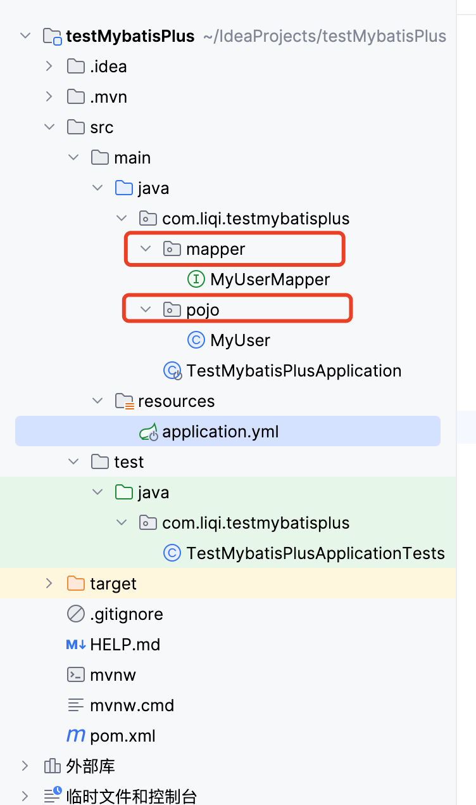

## 项目的主要创建步骤和包

- 使用 IDEA 进行创建

  - 选择  SPring intializr  生成器进行
    - 类型选择 Maven
      - 使用 Spring boot 版本为 3.1.5
        - 依赖项有  `Spring Boot DevTools`  ， `MySQL Driver` ，`MyBtis Framework` ，`Lombok`

- 创建项目后，再添加 pom.xml 文件中的配置项目：

  - ```xml
    <!-- 都放在下面的大标签中 -->
    <dependencies>
    <!-- 添加 mybatis-plus- 支持  -->
    			<dependency>
                <groupId>com.baomidou</groupId>
                <artifactId>mybatis-plus-boot-starter</artifactId>
                <version>3.5.4.1</version>
            </dependency>
      
    </dependencies>
    ```


## 数据库环境

创建 Mysql 8.0 以上的版本服务器

创建数据库  `test`

```sql
CREATE DATABASE `test`
```

创建表 `my_user`

```sql
CREATE TABLE `my_user` (
  `id` int NOT NULL,
  `age` int DEFAULT NULL,
  `username` varchar(10) NOT NULL DEFAULT '',
  PRIMARY KEY (`id`)
) ENGINE=InnoDB DEFAULT CHARSET=utf8mb3
```


## 基础代码

- 创建 软件包 `mapper`  和 `pojo` 




- 添加接口代码  `MyUserMapper.java ` 到 mapper 软件包下

```java
package com.liqi.testmybatisplus.mapper;

import com.baomidou.mybatisplus.core.mapper.BaseMapper;
import com.liqi.testmybatisplus.pojo.MyUser;
import org.springframework.stereotype.Repository;

@Repository
public interface MyUserMapper extends BaseMapper<MyUser> {
}
```

- 添加表名和表字段代码  `MyUser`  , 表名为 `my_user`

```java
package com.liqi.testmybatisplus.pojo;

import com.baomidou.mybatisplus.annotation.TableId;
import com.baomidou.mybatisplus.annotation.TableName;
import lombok.Data;

@Data
@TableName("my_user")
public class MyUser {
    @TableId
	//  @TableId(type = IdType.AUTO)		// 这里表示id 是个自增主键
    private Integer id;

    private Integer age;

    private String username;
}
```


- 修改 Spring boot 的启动 Java 代码文件

```java
package com.liqi.testmybatisplus;

import org.mybatis.spring.annotation.MapperScan;
import org.springframework.boot.SpringApplication;
import org.springframework.boot.autoconfigure.SpringBootApplication;

@SpringBootApplication
// 其他内容不改动， 只新增下面的一行注释
@MapperScan("com.liqi.testmybatisplus.mapper")
public class TestMybatisPlusApplication {

    public static void main(String[] args) {
        SpringApplication.run(TestMybatisPlusApplication.class, args);
    }
}
```

- 修改 `resources` 配置目录下的内容
  - 删除原本的  `application` 文件
  - 新增 `application.yml` 文件， 内容如下

```yaml
spring:
  datasource:
    driver-class-name: com.mysql.cj.jdbc.Driver
    # 最后的 useSSL=false 和 serverTimezone 是必须要求的，（mysql8）
    # Test 是 数据库 库名
    url: jdbc:mysql://localhost:3306/Test?useUnicode=true&characterEncoding=utf-8&serverTimezone=GMT%2B8&useSSL=false
    username: root
    password: 123456
    # 配置数据源类型
    type: com.zaxxer.hikari.HikariDataSource

mybatis-plus:
  configuration:
    log-impl: org.apache.ibatis.logging.commons.JakartaCommonsLoggingImpl
```


## 测试代码

来到 `test.java.`  下的测试代码

```java
package com.liqi.testmybatisplus;

import com.liqi.testmybatisplus.mapper.MyUserMapper;
import com.liqi.testmybatisplus.pojo.MyUser;
import org.junit.jupiter.api.Test;
import org.springframework.beans.factory.annotation.Autowired;
import org.springframework.boot.test.context.SpringBootTest;

import java.util.HashMap;
import java.util.List;
import java.util.Map;

@SpringBootTest
class TestMybatisPlusApplicationTests {

    @Autowired
    private MyUserMapper myUserMapper;

    @Test
    void testSelect() {
        // 通过条件构造器查询一个list集合，若没有条件，则可以设置null参数
        List<MyUser> myUsers = myUserMapper.selectList(null);
        myUsers.forEach(System.out::println);
    }


    @Test
    void testInsert() {
        MyUser myUser = new MyUser();
        myUser.setUsername("ssadas");
        myUser.setAge(44);
        int rest = myUserMapper.insert(myUser);
        System.out.println("rest: " + rest );
    }

    @Test
    void testUpdate() {

        // 通过ID进行更新
        // UPDATE my_user SET username = 'aaaa', age = 20 WHERE id = 1;
        MyUser myUser = new MyUser();
        myUser.setId(1);            // 这个是查找的主键，其他的是要修改的内容
        myUser.setUsername("aaaa");
        myUser.setAge(20);
        int rest = myUserMapper.updateById(myUser);
        System.out.println("rest: " + rest );
    }

    @Test
    void testDelete() {
        // 指定的ID 进行删除
        // DELETE FROM my_user WHERE id = 1;
        int rest = myUserMapper.deleteById(1);
        System.out.println("rest: " + rest );

        // 使用 and 条件进行删除
        // DELETE FROM my_user WHERE username = 'liqi' AND age = 18;
        Map<String, Object> map = new HashMap<>();
        map.put("username", "liqi");
        map.put("age", 18);
        rest = myUserMapper.deleteByMap(map);
        System.out.println("rest: " + rest );

        // 使用 or 条件进行删除
        // DELETE FROM my_user WHERE id = 1 OR id = 2;
        List<Integer> ids = List.of(4, 5);
        rest = myUserMapper.deleteBatchIds(ids);
        System.out.println("rest: " + rest );
    }
}

```

