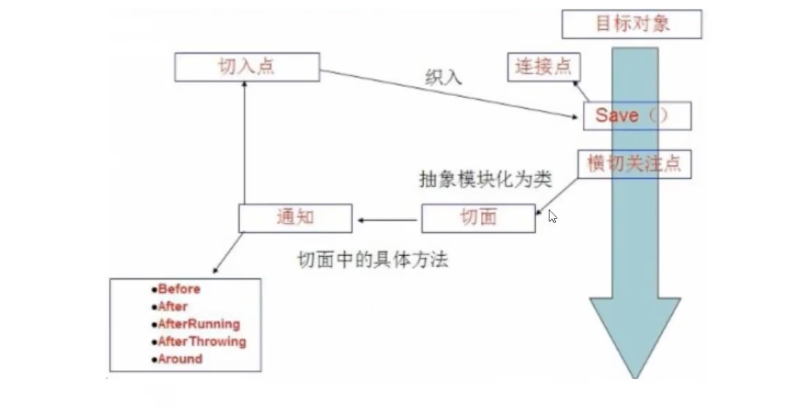

## 目录

- [AOP](#AOP)
  - [使用String的API接口实现AOP](#使用String的API接口实现AOP)
  - [自定义来实现AOP](#自定义来实现AOP)
  - [注解实现](#注解实现)


# AOP

AOP 的底层是基于动态代理的。

- **Aop在Spring中的作用**
  - 提供声明式事务；允许用户自定义切面
    - 横切关注点：跨越应用程序多个模块的方法或功能。即是，与我们业务逻辑无关的，但是我们需要关注的部分，就是横切关注点。如日志，安全，缓存，事务等等…
    - 切面 (ASPECT)：横切关注点 被模块化 的特殊对象。即，它是一个类.
    - 通知 (Advice）：切面必须要完成的工作。即，它是类中的一个方法。
    - 目标 (Target)：被通知对象。
    - 代理 (Proxy)：向目标对象应用通知之后创建的对象。
    - 切入点 (Pointcut)：切面通知执行的“地点”的定义。
    - 连接点 UointPoint)：与切入点匹配的执行点。



## 使用String的API接口实现AOP

**主要SpringAPI接口实现**


- AfterLog.java

  - ```java
    package com.kuang.log;
    
    import org.springframework.aop.AfterReturningAdvice;
    
    import java.lang.reflect.Method;
    
    public class AfterLog implements AfterReturningAdvice {
    
        // 后置
        //returnValue :  这是一个返回值
        @Override
        public void afterReturning(Object returnValue, Method method, Object[] args, Object target) throws Throwable {
            System.out.println("执行了" + method.getName() + "返回结果为：" + returnValue);
        }
    }
    ```

- Log.java

  - ```java
    package com.kuang.log;
    
    import org.springframework.aop.MethodBeforeAdvice;
    
    import java.lang.reflect.Method;
    
    public class Log implements MethodBeforeAdvice {
    
        // method  : 要执行的目标对象的方法
        // args    : 参数
        // target :  目标对象
        // 前置， 该方法会在我的执行方法之前 自动去调用
        @Override
        public void before(Method method, Object[] args, Object target) throws Throwable {
            System.out.println(target.getClass().getName() + "的" + method.getName() + "被执行了");
        }
    }
    ```

- UserService.java

  - ```java
    package com.kuang.service;
    
    public interface UserService {
        public void add();
        public void delete();
        public void update();
        public void select();
    }
    ```

- UserServiceImpl.java

  - ```java
    package com.kuang.service;
    
    public class UserServiceImpl implements UserService{
        @Override
        public void add() {
            System.out.println("增加了一个用户");
        }
    
        @Override
        public void delete() {
            System.out.println("删除了一个用户");
        }
    
        @Override
        public void update() {
            System.out.println("更新了一个用户");
        }
    
        @Override
        public void select() {
            System.out.println("查询了一个用户");
        }
    }
    
    ```

- applicationContext.xml

  - ```xml
    <?xml version="1.0" encoding="UTF-8"?>
    <beans xmlns="http://www.springframework.org/schema/beans"
    	   xmlns:xsi="http://www.w3.org/2001/XMLSchema-instance"
    	   xmlns:aop="http://www.springframework.org/schema/aop"
    	   xsi:schemaLocation="http://www.springframework.org/schema/beans
            http://www.springframework.org/schema/beans/spring-beans.xsd
            http://www.springframework.org/schema/aop
            http://www.springframework.org/schema/aop/spring-aop.xsd">
    
    	<!-- 注册 bean -->
    	<bean id="userService" class="com.kuang.service.UserServiceImpl"/>
    	<bean id="log" class="com.kuang.log.Log"/>
    	<bean id="afterLog" class="com.kuang.log.AfterLog"/>
    
        <!-- 方式1， 使用原生 Sprintg API 接口 -->
    	<!-- 配置 aop , 需要导入 aop 约束 -->
    	<aop:config>
    <!--   配置切入点, 切入点：  expression:表达式, execution(*返回值  包名.*类名.*方法名(..方法的参数不限 ) ) -->
            <aop:pointcut id="pointcur" expression="execution(* com.kuang.service.UserServiceImpl.*(..) ))"/>
            <!--  执行环绕增强 -->
    		<aop:advisor advice-ref="log" pointcut-ref="pointcur"/>
    		<aop:advisor advice-ref="afterLog" pointcut-ref="pointcur"/>
        </aop:config>
    
    
    </beans>
    ```

- MyTest.java

  - ```java
    import com.kuang.service.UserService;
    import org.springframework.context.ApplicationContext;
    import org.springframework.context.support.ClassPathXmlApplicationContext;
    
    public class MyTest {
        public static void main(String[] args) {
          ApplicationContext context =  new ClassPathXmlApplicationContext("applicationContext.xml");
            UserService userService = (UserService)context.getBean("userService");
            userService.add();
        }
    }
    
    /* 输出为： 
    com.kuang.service.UserServiceImpl的add被执行了
    增加了一个用户
    执行了add返回结果为：null
    */
    ```


## 自定义来实现AOP

**主要是切面定义**

- applicationContext.xml

  - ```xml
    <?xml version="1.0" encoding="UTF-8"?>
    <beans xmlns="http://www.springframework.org/schema/beans"
    	   xmlns:xsi="http://www.w3.org/2001/XMLSchema-instance"
    	   xmlns:aop="http://www.springframework.org/schema/aop"
    	   xsi:schemaLocation="http://www.springframework.org/schema/beans
            http://www.springframework.org/schema/beans/spring-beans.xsd
            http://www.springframework.org/schema/aop
            http://www.springframework.org/schema/aop/spring-aop.xsd">
    
    	<!-- 注册 bean -->
    	<bean id="userService" class="com.kuang.service.UserServiceImpl"/>
    	<bean id="log" class="com.kuang.log.Log"/>
    	<bean id="afterLog" class="com.kuang.log.AfterLog"/>
    	 
    	<!-- 方式2， 自定义来实现AOP  -->
    	<bean id="diy" class="com.kuang.diy.DiyPointCut"/>
    	<!-- 配置 aop , 需要导入 aop 约束 -->
    	<aop:config>
    		<!-- 自定义切面， ref 要引用的类-->
    		<aop:aspect ref="diy">
    			<!-- 切入点 -->
    			<aop:pointcut id="pointcur" expression="execution(* com.kuang.service.UserServiceImpl.*(..) ))"/>
    			<!-- 通知 -->
    			<aop:before method="before" pointcut-ref="pointcur"/> <!-- 在执行之前要执行的方法(自定义的) -->
    			<aop:after method="after" pointcut-ref="pointcur"/>   <!-- 在执行之后要执行的方法(自定义的) -->
    		</aop:aspect>
    	</aop:config>
    
    
    </beans>
    ```

- MyTest.java

  - ```java
    import com.kuang.service.UserService;
    import org.springframework.context.ApplicationContext;
    import org.springframework.context.support.ClassPathXmlApplicationContext;
    
    public class MyTest {
        public static void main(String[] args) {
          ApplicationContext context =  new ClassPathXmlApplicationContext("applicationContext.xml");
            UserService userService = (UserService)context.getBean("userService");
    //        System.out.println(userService.getClass().toString());
            userService.add();
        }
    }
    
    /* 输出为： 
    ===方法执行前===
    增加了一个用户
    ===方法执行后===
    */
    ```

- DiyPointCut.java

  - ```java
    package com.kuang.diy;
    
    public class DiyPointCut {
        public void before(){
            System.out.println("===方法执行前===");
        }
        public void after(){
            System.out.println("===方法执行后===");
        }
    }
    ```

- UserService.java

  - ```java
    package com.kuang.service;
    
    public interface UserService {
        public void add();
        public void delete();
        public void update();
        public void select();
    }
    ```

- UserServiceImpl.java

  - ```java
    package com.kuang.service;
    
    public class UserServiceImpl implements UserService{
        @Override
        public void add() {
            System.out.println("增加了一个用户");
        }
    
        @Override
        public void delete() {
            System.out.println("删除了一个用户");
        }
    
        @Override
        public void update() {
            System.out.println("更新了一个用户");
        }
    
        @Override
        public void select() {
            System.out.println("查询了一个用户");
        }
    }
    
    ```

- 


## 注解实现


- AnnotationPointCut.java

  - ```java
    package com.kuang.diy;
    
    import org.aspectj.lang.ProceedingJoinPoint;
    import org.aspectj.lang.annotation.After;
    import org.aspectj.lang.annotation.Around;
    import org.aspectj.lang.annotation.Aspect;
    import org.aspectj.lang.annotation.Before;
    
    // 方式三： 使用注解方式实现AOP
    @Aspect     // 标柱这个类是一个切面
    public class AnnotationPointCut {
        // 切入点
        @Before("execution(* com.kuang.service.UserServiceImpl.*(..))")
        public void before()
        {
            System.out.println("=====方法执行前====== AnnotationPointCut");
        }
    
        // 切入点
        @After("execution(* com.kuang.service.UserServiceImpl.*(..))")
        public void fater()
        {
            System.out.println("=====方法执行后====== AnnotationPointCut");
        }
    
        // 环绕增强， 我们可以给定一个参数，代表我们要获取处理切入的点：
        @Around("execution(* com.kuang.service.UserServiceImpl.*(..))")
        public void around(ProceedingJoinPoint jp) throws Throwable {
            // 该函数的执行顺序：  环绕前->打印签名->方法执行前-> 执行方法 -> 环绕后 -> 方法执行后   结束
            System.out.println("=====环绕前====== AnnotationPointCut");
            // 获得和打印签名; 输出： void com.kuang.service.UserService.add()
            System.out.println(jp.getSignature());
            // 执行方法
            Object proceed = jp.proceed();
            System.out.println("=====环绕后====== AnnotationPointCut");
        }
    
    }
    ```

- applicationContext.xml

  - ```xml
    <?xml version="1.0" encoding="UTF-8"?>
    <beans xmlns="http://www.springframework.org/schema/beans"
    	   xmlns:xsi="http://www.w3.org/2001/XMLSchema-instance"
    	   xmlns:aop="http://www.springframework.org/schema/aop"
    	   xsi:schemaLocation="http://www.springframework.org/schema/beans
            http://www.springframework.org/schema/beans/spring-beans.xsd
            http://www.springframework.org/schema/aop
            http://www.springframework.org/schema/aop/spring-aop.xsd">
    
      <!-- 注册 bean -->
    	<bean id="userService" class="com.kuang.service.UserServiceImpl"/>
    	<bean id="log" class="com.kuang.log.Log"/>
    	<bean id="afterLog" class="com.kuang.log.AfterLog"/>
    
    	<!-- 方式三：使用注解方式实现AOP -->
    	<bean id="annotationPointCut" class="com.kuang.diy.AnnotationPointCut"/>
    	<!-- 开启AOP注解支持-->
    	<aop:aspectj-autoproxy/>
    
    </beans>
    ```

- UserService.java

  - ```java
    package com.kuang.service;
    
    public interface UserService {
        public void add();
        public void delete();
        public void update();
        public void select();
    }
    ```

- UserServiceImpl.java

  - ```java
    package com.kuang.service;
    
    public class UserServiceImpl implements UserService{
        @Override
        public void add() {
            System.out.println("增加了一个用户");
        }
    
        @Override
        public void delete() {
            System.out.println("删除了一个用户");
        }
    
        @Override
        public void update() {
            System.out.println("更新了一个用户");
        }
    
        @Override
        public void select() {
            System.out.println("查询了一个用户");
        }
    }
    ```

- MyTest.java

  - ```java
    import com.kuang.service.UserService;
    import org.springframework.context.ApplicationContext;
    import org.springframework.context.support.ClassPathXmlApplicationContext;
    
    public class MyTest {
        public static void main(String[] args) {
          ApplicationContext context =  new ClassPathXmlApplicationContext("applicationContext.xml");
            UserService userService = (UserService)context.getBean("userService");
            userService.add();
        }
    }
    
    /* 输出：
    =====环绕前====== AnnotationPointCut
    void com.kuang.service.UserService.add()
    =====方法执行前====== AnnotationPointCut
    增加了一个用户
    =====环绕后====== AnnotationPointCut
    =====方法执行后====== AnnotationPointCut
    */
    ```

  - 


