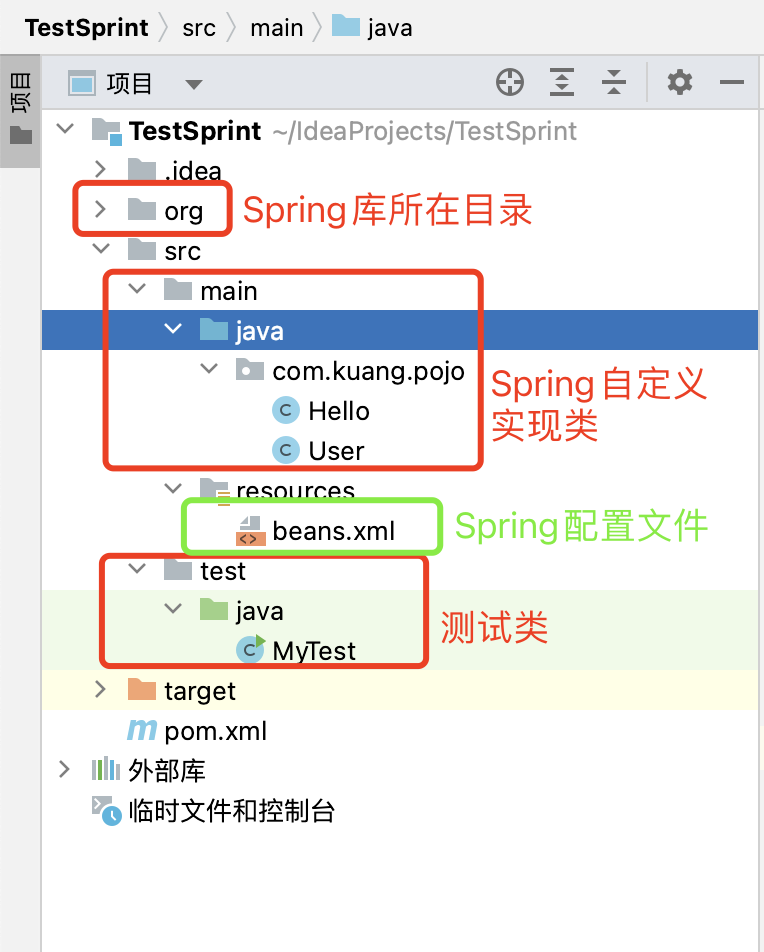

## 目录

- [Spring开发](#Spring开发)
  - [Spring_Framework](#Spring_Framework)

- [Spring项目创建和所需文件](#Spring项目创建和所需文件)

## Spring开发

什么是Spring？

Spring是一个支持快速开发Java EE应用程序的框架。它提供了一系列底层容器和基础设施，并可以和大量常用的开源框架无缝集成，可以说是开发Java EE应用程序的必备。

Spring最早是由Rod Johnson这哥们在他的《[Expert One-on-One J2EE Development without EJB](https://book.douban.com/subject/1426848/)》一书中提出的用来取代EJB的轻量级框架。随后这哥们又开始专心开发这个基础框架，并起名为Spring Framework。

随着Spring越来越受欢迎，在Spring Framework基础上，又诞生了Spring Boot、Spring Cloud、Spring Data、Spring Security等一系列基于Spring Framework的项目。本章我们只介绍Spring Framework，即最核心的Spring框架。后续章节我们还会涉及Spring Boot、Spring Cloud等其他框架。

### Spring_Framework

Spring Framework主要包括几个模块：

- 支持IoC和AOP的容器；
- 支持JDBC和ORM的数据访问模块；
- 支持声明式事务的模块；
- 支持基于Servlet的MVC开发；
- 支持基于Reactive的Web开发；
- 以及集成JMS、JavaMail、JMX、缓存等其他模块。

我们会依次介绍Spring Framework的主要功能。

本教程使用的Spring版本是6.x版，如果使用Spring 5.x则需注意，两者有以下不同：

|              | Spring 5.x       | Spring 6.x         |
| :----------- | :--------------- | :----------------- |
| JDK版本      | >= 1.8           | >= 17              |
| Tomcat版本   | 9.x              | 10.x               |
| Annotation包 | javax.annotation | jakarta.annotation |
| Servlet包    | javax.servlet    | jakarta.servlet    |
| JMS包        | javax.jms        | jakarta.jms        |
| JavaMail包   | javax.mail       | jakarta.mail       |

如果使用Spring的其他版本，则需要根据需要调整代码。

Spring官网是[spring.io](https://spring.io/)，要注意官网有许多项目，我们这里说的Spring是指Spring Framework，可以直接从这里访问[最新版以及文档](https://spring.io/projects/spring-framework)，建议添加到浏览器收藏夹。


## Spring项目创建和所需文件

尽量使用IDE来创建 Maven项目。

所需文件有:

```ascii
spring-aop-5.0.8.RELEASE.jar
spring-beans-5.0.8.RELEASE.jar
spring-boot-2.0.4.RELEASE.jar
spring-boot-actuator-2.0.4.RELEASE.jar
spring-boot-actuator-autoconfigure-2.0.4.RELEASE.jar
spring-boot-autoconfigure-2.0.4.RELEASE.jar
spring-boot-starter-2.0.4.RELEASE.jar
spring-boot-starter-actuator-2.0.4.RELEASE.jar
spring-boot-starter-aop-2.0.4.RELEASE.jar
spring-boot-starter-freemarker-2.0.4.RELEASE.jar
spring-boot-starter-json-2.0.4.RELEASE.jar
spring-boot-starter-logging-2.0.4.RELEASE.jar
spring-boot-starter-tomcat-2.0.4.RELEASE.jar
spring-boot-starter-web-2.0.4.RELEASE.jar
spring-cloud-commons-2.0.0.RELEASE.jar
spring-cloud-context-2.0.0.RELEASE.jar
spring-cloud-netflix-archaius-2.0.0.RELEASE.jar
spring-cloud-netflix-core-2.0.0.RELEASE.jar
spring-cloud-netflix-eureka-client-2.0.0.RELEASE.jar
spring-cloud-netflix-eureka-server-2.0.0.RELEASE.jar
spring-cloud-netflix-ribbon-2.0.0.RELEASE.jar
spring-cloud-starter-2.0.0.RELEASE.jar
spring-cloud-starter-netflix-archaius-2.0.0.RELEASE.jar
spring-cloud-starter-netflix-eureka-server-2.0.0.RELEASE.jar
spring-cloud-starter-netflix-ribbon-2.0.0.RELEASE.jar
spring-context-5.0.8.RELEASE.jar
spring-context-support-5.0.8.RELEASE.jar
spring-core-5.0.8.RELEASE.jar
spring-expression-5.0.8.RELEASE.jar
spring-jcl-5.0.8.RELEASE.jar
spring-security-crypto-5.0.7.RELEASE.jar
spring-security-rsa-1.0.5.RELEASE.jar
spring-web-5.0.8.RELEASE.jar
spring-webmvc-5.0.8.RELEASE.jar
```

项目文件分配如图：



- Hello.java    具体的实现类

```java
package com.kuang.pojo;

public class Hello {
    private String str;

    @Override
    public String toString() {
        return "Hello{" +
                "str='" + str + '\'' +
                '}';
    }

    public void setStr(String str) {	// 必须有 set 方法
        this.str = str;
    }

    public String getStr() {
        return str;
    }
}
```

- User.java    具体的实现类

```java
package com.kuang.pojo;

public class User {
    private String name;

    public User(String name) {
        this.name = name;
    }

    public String getName() {  
        return name;
    }

    public void setName(String name) {  	// 必须有 set 方法
        this.name = name;
    }

    public void show()
    {
        System.out.println("name=" + name);
    }
}
```

- MyTest    测试类

```java
import com.kuang.pojo.Hello;
import com.kuang.pojo.User;
import org.springframework.context.ApplicationContext;
import org.springframework.context.support.ClassPathXmlApplicationContext;

public class MyTest {
    public static void main(String[] args) {
        // 获取 Spring 的上下文对象（也就是容器）
        ApplicationContext context = new ClassPathXmlApplicationContext("beans.xml");
        Hello hello = (Hello) context.getBean("hello");
        System.out.println(hello.toString());
        User user = (User)context.getBean("user");
        user.show();
    }
}
```

- beans.xml    Spring的配置文件

```xml
<?xml version="1.0" encoding="UTF-8"?>
<beans xmlns="http://www.springframework.org/schema/beans"
       xmlns:xsi="http://www.w3.org/2001/XMLSchema-instance"
       xsi:schemaLocation="http://www.springframework.org/schema/beans
        http://www.springframework.org/schema/beans/spring-beans.xsd">

<!-- 使用 Spring 来创建对象， 在Spring 中这些都称为 Bean
        只能写实现类，不能写接口
    类型 交量名 = new 类型 ()；
        Hello hello = new Hello ();
-->
    <bean id="hello" class="com.kuang.pojo.Hello" name="hello1,hello2,hello3" >
<!--    使用无参构造来创建对象。
				id = 变量名(可以用来获取对应的类对象),唯一标识符
        class = new 的对象, 是对象所对应的全限定名: 包名 + 类型
				name = 别名, 可以通过逗号或空格来同时取多个别名
        property = 相当于给对象中的属性设置一个值！
        value =  具体的值，基本数据类型
        ref = 引用 Spring 容器中已经创建好的对象 (该属性会放在 property 尖括号中)
-->
        <property name="str" value="Spring"/>
    </bean>

    <bean id="user" class ="com.kuang.pojo.User">
        <!-- 有参构造的方式1  ： 下标赋值 -->
        <!-- <constructor-arg index="0" value="房山"/>-->

        <!-- 有参构造的方式2  ： 类型赋值 (不建议使用) -->
        <!-- <constructor-arg type="java.lang.String" value="天下"/> -->

        <!-- 有参构造的方式3  ： 参数名称赋值  (方便)-->
        <constructor-arg name="name"  value="名称"/>
    </bean>
</beans>
```
