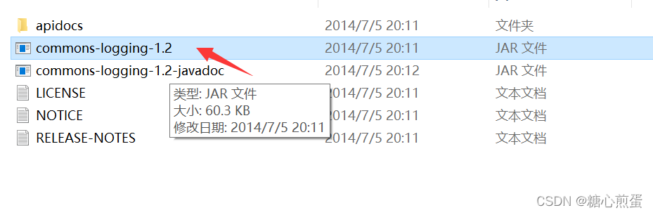
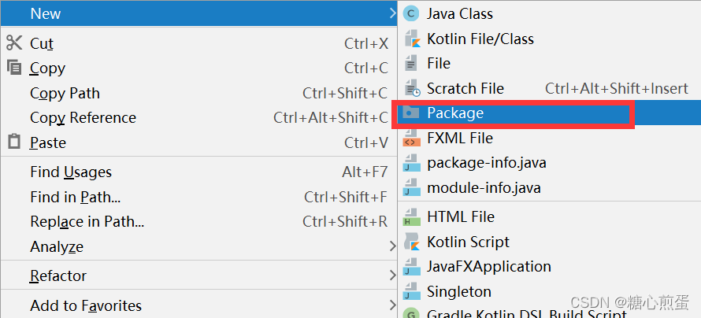
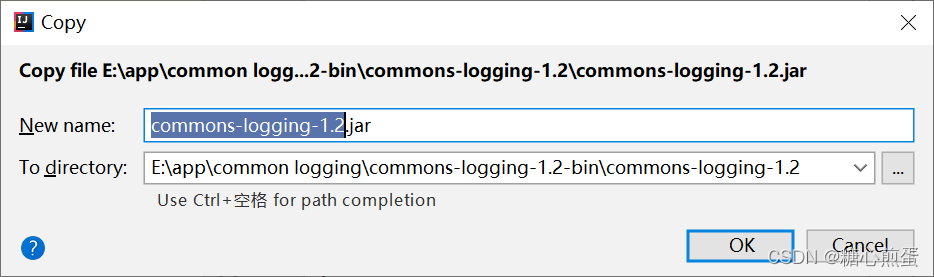
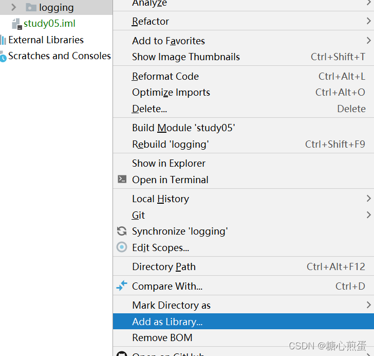

### 目录

- [导入第三方库到项目](#导入第三方库到项目)
  - [1、下载和使用第三方库](#1、下载和使用第三方库)
  - [2、复制commons-logging-1.2.jar文件](#2、复制commons-logging-1.2.jar文件)
  - [3、打开IDEA新建一个package](#3、打开IDEA新建一个package)
  - [4、把jar包复制到刚创建的包下](#4、把jar包复制到刚创建的包下)
  - [5、添加到Library中](#5、添加到Library中)
  - [6、出现有下拉选项表示成功](#6、出现有下拉选项表示成功)

- [命令行编译和运行命令](#命令行编译和运行命令)
- 


### 导入第三方库到项目

#### 1、下载和使用第三方库

```bash
一、官网下载commons-logging-1.2.jar包
下载链接：  https://commons.apache.org/proper/commons-logging/download_logging.cgi
     下载 Binaries  文件即可 : commons-logging-1.2-bin.zip
					解压后生成如下两个文件
								commons-logging-1.2-javadoc.jar
								commons-logging-1.2.jar
```


#### 2、复制commons-logging-1.2.jar文件



#### 3、打开IDEA新建一个package



#### 4、把jar包复制到刚创建的包下




#### 5、添加到Library中



#### 6、出现有下拉选项表示成功


## 命令行编译和运行命令

[java编译命令具体说明](./java编译和运行命令.md)

```bash
编译前目录结构如下：
T2
└── src
    └── logging
        ├── CommonsTest.java
        ├── commons-logging-1.2-javadoc.jar
        ├── commons-logging-1.2.jar
        └── loggingTest.java


# 编译命令
cd T2			# 工作目录切换为T2
javac -d T2/bin -cp  T2/src/logging/commons-logging-1.2.jar  T2/src/**/*.java 
 

# 运行命令
cd T2			# 工作目录切换为T2
java  -Dfile.encoding=UTF-8 -Dsun.stdout.encoding=UTF-8 -Dsun.stderr.encoding=UTF-8 -classpath "T2/bin":"T2/src/logging/commons-logging-1.2.jar" logging.CommonsTest


#  -classpath      <目录和 zip/jar 文件的类搜索路径> ，可以简写为 -cp


编译后目录结构如下：
T2
├── bin
│   └── logging
│       ├── CommonsTest.class
│       └── loggingTest.class
└── src
    └── logging
        ├── CommonsTest.java
        ├── commons-logging-1.2-javadoc.jar
        ├── commons-logging-1.2.jar
        └── loggingTest.java
```

